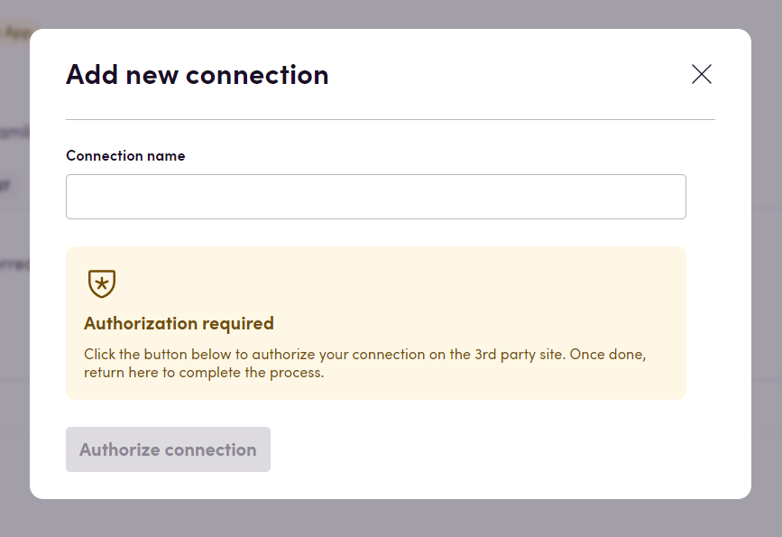

# Blackbird.io Crowdin

Blackbird is the new automation backbone for the language technology industry. Blackbird provides enterprise-scale automation and orchestration with a simple no-code/low-code platform. Blackbird enables ambitious organizations to identify, vet and automate as many processes as possible. Not just localization workflows, but any business and IT process. This repository represents an application that is deployable on Blackbird and usable inside the workflow editor.

## Introduction

<!-- begin docs -->

Crowdin is a cloud-based localization platform that helps businesses and organizations manage the translation of their software, apps, websites, and other digital content into multiple languages. It provides a collaborative environment where translators and project managers can work together to translate and localize content efficiently.

## Before Connecting

1. Make sure you have access to an account on the CrowdIn instance you want to connect to.
2. If you want to make use of events. Make sure your account has sufficient permissions to create webhooks.

## Connecting

1. Navigate to apps and search for Crowdin. If you cannot find Crowdin then click _Add App_ in the top right corner, select Crowdin and add the app to your Blackbird environment.
2. Click _Add Connection_.
3. Name your connection for future reference e.g. 'My Crowdin connection'.
4. Select your Crowdin plan. It could be either Basic or Enterprise. See more at https://crowdin.com/pricing
5. Click _Authorize connection_.
6. As a new window pops up, follow the instructions from Crowdin.
7. When you return to Blackbird, confirm that the connection has appeared and the status is _Connected_.

## Actions

> Please note that the app works with both Crowdin plans: Enterprise and Basic. However, some actions are unavailable on the Basic plan. These actions are marked as [Enterprise] at the beginning of their name and are only available for the Enterprise plan.

### Comment 

- **Add string comment** Add new string comment
- **Delete string comment** Delete specific string comment
- **Get string comment** Get specific string comment
- **List comments** List string comments for a project

### Directory

- **Search directories** List all directories
- **Add directory** Add a new directory
- **Get directory by ID** Get a specific directory by ID
- **Get directory by path** Get a specific directory by path

### File 

- **Add file** Add new file
- **Add or update file** Add or update file
- **Delete file** Delete specific file
- **Download file** Download specific file
- **Get file** Get specific file info
- **List files** List project files
- **Update file** Update an existing file with new content

### Glossary

- **Import glossary** Import glossary from TBX file
- **Export glossary** Export glossary as TBX file

### Machine Translation 

- **List machine translation engines** List all machine translation engines
- **Translate lines via machine translation engine** Translate multiple text lines via machine translation engine
- **Translate via machine translation engine** Translate text via machine translation engine

### Project 

- **Add project** Add new project
- **Delete project** Delete specific project
- **Get project** Get specific project
- **Search projects** List all projects
- **Build project** Build project translation

### Project Group

- **[Enterprise] Add project group** Add a new project group
- **[Enterprise] Delete project group** Delete specific project group
- **[Enterprise] Get project group** Get specific project group
- **[Enterprise] Search project groups** List all project groups

### Reviewed File

- **Build reviewed source files** Build reviewed source files of specific project
- **Download reviewed source files as ZIP** Download reviewed source files of specific build as ZIP
- **Download reviewed source files** Download reviewed source files of specific build
- **Get reviewed source files build** Get specific reviewed source files build
- **Search reviewed source files builds** List all reviewed source files builds of specific project

### Source String 

- **Add source string** Add new source string
- **Delete source string** Delete specific source string
- **Get source string** Get specific source string
- **Search strings** List all project source strings

### Storage

- **Add storage** Add new storage
- **Delete storage** Delete specific storage
- **Get storage** Get specific storage
- **Search storages** List all storages

### Task 

- **Add task** Add new task
- **Delete task** Delete specific task
- **Download task strings as XLIFF** Download specific task strings as XLIFF
- **Get task** Get specific task
- **Search tasks** List all tasks

### Team

- **[Enterprise] Add team** Add a new team
- **[Enterprise] Delete team** Delete specific team
- **[Enterprise] Get team** Get specific team
- **[Enterprise] Search teams** List all teams

### Translation 

- **Add file translation** Add new file translation
- **Add string translation** Add new string translation
- **Apply pre-translation** Apply pre-translation to chosen files
- **Delete translation** Delete specific translation
- **Download file translation** Builds and downloads the translation of a file
- **Get translation** Get specific translation
- **List language translations** List project language translations
- **List string translations** List project string translations

### Translation Memory 

- **Add translation memory segment** Add new segment to the translation memory
- **Add translation memory** Add new translation memory
- **Delete translation memory** Delete specific translation memory
- **Download translation memory** Download specific translation memory
- **Export translation memory** Export specific translation memory
- **Get translation memory** Get specific translation memory
- **Search translation memories** List all translation memories

### Users

- **Search project members** Get all matching project members. Filter by role or language.
- **Find project member** Get first matching project member. Filter by role, language or username/fist name/last name.
- **Invite user** Add a new user
- **Delete user** Delete specific user

## Events

### Comment 

- **On string comment created** On string comment created
- **On string comment deleted** On string comment deleted
- **On string comment restored** On string comment restored
- **On string comment updated** On string comment updated

### File

 - **On file added** On file added
- **On file approved** On file approved
- **On file deleted** On file deleted
- **On file reverted** On file reverted
- **On file translated** On file fully translated
- **On file updated** On file updated
- **On file added or updated** Triggers when file added or updated

### Project

- **On project approved** On project approved
- **On project built** On project built
- **On project created** On project created
- **On project deleted** On project deleted
- **On project translated** On project translated

### Project groups

- **[Enterprise] On group created** On group created (enterprise only)
- **[Enterprise] On group deleted** On group deleted (enterprise only)

### String

- **On string added** On string added
- **On string deleted** On string deleted
- **On string updated** On string updated

### Suggestion

- **On suggestion added** On suggestion added
- **On suggestion approved** On suggestion approved
- **On suggestion deleted** On suggestion deleted
- **On suggestion disapproved** On suggestion disapproved
- **On suggestion updated** On suggestion updated

### Task

- **On task added** On task added
- **On task deleted** On task deleted
- **On task status changed** On task status changed

### Translation

- **On translation updated** On translation updated

### Pre-translations

- **On pre-translations status changed** Triggered when the status of all pre-translations in a project changes to one of the specified statuses.

## Feedback

Do you want to use this app or do you have feedback on our implementation? Reach out to us using the [established channels](https://www.blackbird.io/) or create an issue.

<!-- end docs -->
